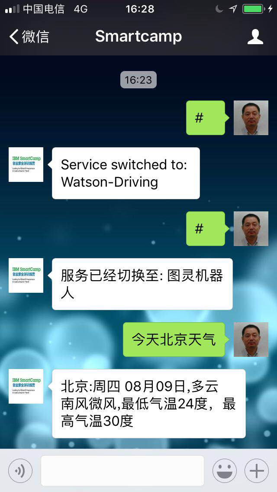

## Setup & Run
1. install python runtime
1. install itchat: pip install itchat
1. apply service from Tuling ( www.tuling123.com )
1. apply service & create conversation from IBM Bluemix ( bluemix.net )
1. install watson SDK: $ sudo -H pip install --ignore-installed six watson-developer-cloud
1. modify credentials
1. python xx.py 
2. follow wechat "Smartcamp"
3. Interactive conversation w/ "Smartcamp" as follows:

## List of wechat
|Component | Description | Reference |
|-----------------+----------------------------------+-----------------------|
|tuling.py | wechat robot, w/ Tuling backend API | http://www.tuling123.com|
tuling-specUser.py | chat service, restricted for specific wechat-usergroup| https://github.com/littlecodersh/ItChat
watson-console.py | console-based example for waston-conversation
watson-wechat.py | wechat as client | https://github.com/watson-developer-cloud/python-sdk
watson-tuling-wechat.py | wechat client + 2*backends ( # for Tuling, #IBM for Watson )

## Console Apps
### list
* example1.js
* example2.js
* example3.js
* example4.js

### How to run

* npm install
* modify credentials
* nodejs exampleX.js

## List of nodered
watson-debugMode.json | waston-conversation, running in debug mode
|:-----+:------|
watson-sockets.js | run in web mode, socket communication

## How to modify & debug
1. create **node-red** application in **IBM Bluemix**
2. create service Watson conversion
3. launch **Node-red** application -- web designer
4. import flow from above json
5. modifiy 'conversation' node property in these flow

**debug:**
 
1. click flow (left input node)
1. web: https://nodered-jon001.eu-gb.mybluemix.net/testing

